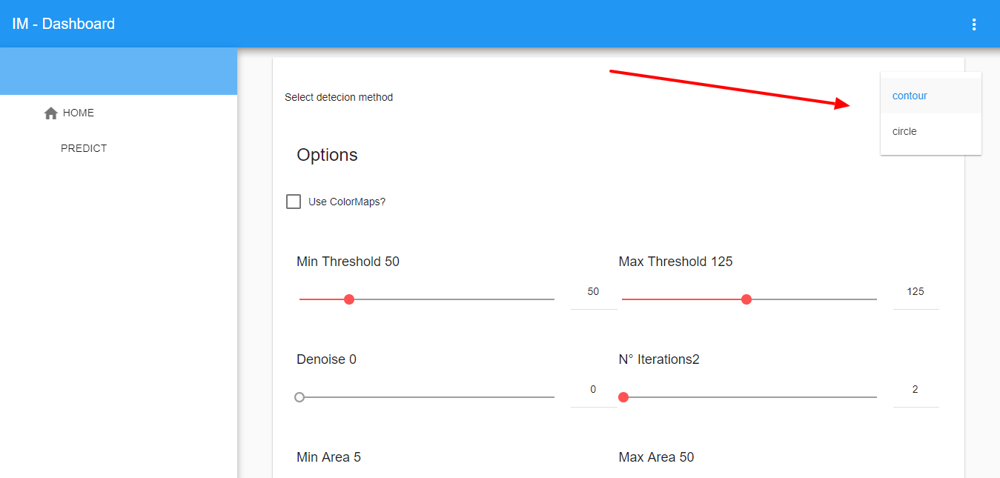
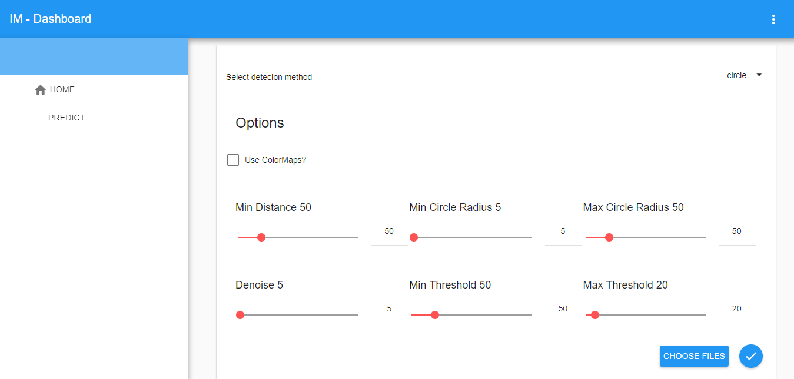
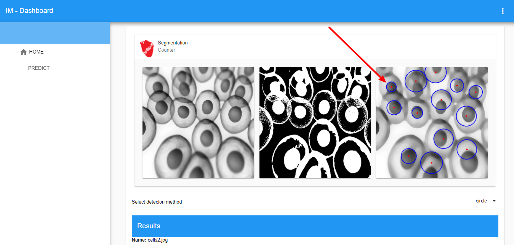
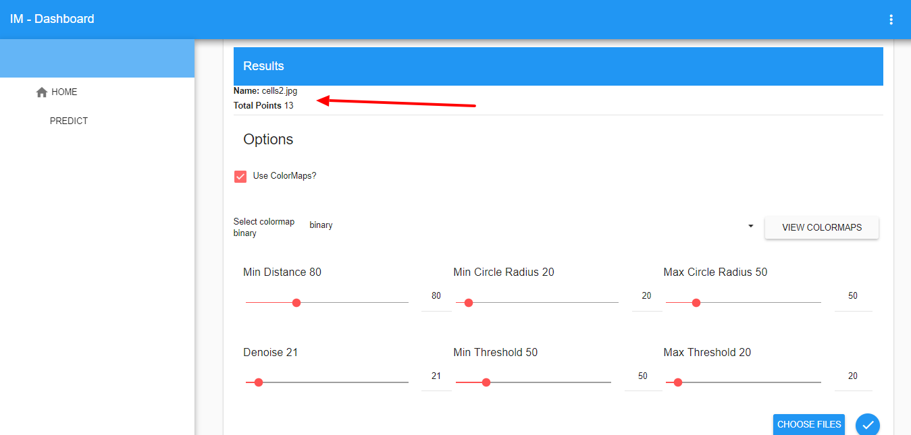

# Open Cell Viewer

This project was made in Heart Institute of São Paulo / InCor.
My lab colleagues had a need to identify specific contours to determine a cell type, so I do a segmentation and then I identify the regions of interest.

Open Cell Viewer is a webapp that takes images and processes them with openCV and returns the processed result.

Below are some more detailed descriptions about the system.

There are two detection possibilities to perform the counts:
Contour count and circular area count. As the image below.
The approaches have some different parameters.

Speaking of the parameters themselves:

## Parameters for contour detection

1. The first are the limits for detection - Minimum and Maximum
2. Denoise - Is the amount of blur applied to the image to eliminate noise.
3. Number of Iterations - It is the thickness of the contour, the bigger, the thicker
4. Min Area and Max Area - Determine the maximum and minimum size of the contour

## Parameters for detecting circular areas

1. Min Distance - It is the minimum distance between one circle (detected) and another
2. Min Circle Radius - It is the minimum diameter that a circle needs to have to be detected
3. Max Circle Radius - Is the maximum diameter a circle needs to have to be detected
4. Denoise - It is the amount of blur applied to the image to eliminate noise.
5. The latter, as with contour detection, are the limit for detection - Minimum and Maximum

**The colormap item contains color spectra to help segment the image.**

**This is a sample image**

**Segmented Result**

With the parameters below, the result was this: **13 circular areas found**.

## Image Prediction

This webapplication also make image training and prediction, but this feature is in progress right now.

## How to Run
Just execute the *app.py* file
